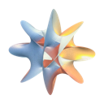
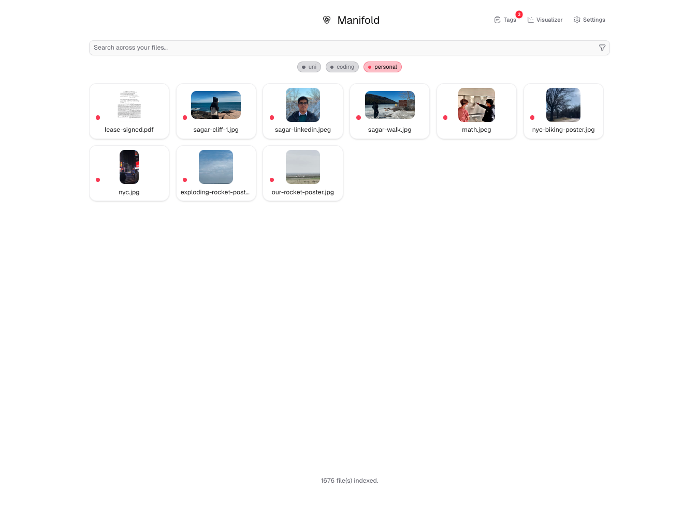

<p align="center">
  
</p>

<h1 align="center">Manifold</h1>

<p align="center">
  Native desktop search for your files — by <strong>keyword</strong>, <strong>meaning</strong>, and <strong>tags</strong>.
  Everything runs locally; folders and embeddings stay on your machine.
</p>

<p align="center">
  
</p>

## What it does

- Hybrid search: text/OCR in file contents, semantic similarity via Gemini embeddings
- Tag files and browse a graph of related documents
- Indexes PDFs, images, video, audio, and common text formats
- Electron app (React + TypeScript), vector store in [Qdrant](https://qdrant.tech/)

## Prerequisites

- [Node.js](https://nodejs.org/) 20+ and [pnpm](https://pnpm.io)
- [Docker Desktop](https://www.docker.com/products/docker-desktop/) — Qdrant runs in Docker during development
- A [Gemini API key](https://aistudio.google.com/apikey) — add it in the app under **Settings → General** (not in `.env`)

## Development

```bash
pnpm install
pnpm setup:dev    # PDFium + FFmpeg dev binaries
pnpm qdrant:up    # start Qdrant (Docker)
pnpm dev          # Electron + Vite
```

**First launch:** the onboarding flow checks Qdrant and Gemini. Then open **Settings → Paths** and add folders to index. Embedding runs automatically in the background.

Optional: Qdrant dashboard at [http://127.0.0.1:6333/dashboard](http://127.0.0.1:6333/dashboard).

Stop Qdrant when you're done:

```bash
pnpm qdrant:down
```

## Build & package

Compile only (no installer):

```bash
pnpm build
```

Installable app (bundles Qdrant + runtime binaries; Docker **not** required for end users):

```bash
pnpm setup:binaries
pnpm dist
```

Output: `release/` (DMG on macOS, etc.).

## Useful commands

| Command | Purpose |
|--------|---------|
| `pnpm dev` | Run app in development |
| `pnpm build` | Typecheck + production frontend/Electron build |
| `pnpm dist` | Build installers (`release/`) |
| `pnpm check` | Lint + TypeScript |
| `pnpm qdrant:up` / `qdrant:down` | Start/stop Docker Qdrant |
| `pnpm setup:dev` | Dev binaries (PDFium, FFmpeg) |
| `pnpm setup:binaries` | Full binaries for packaging/CI |

## Project structure

```
manifold/
├── config/              # Shared app config, including folder exclude rules
├── docs/                # Documentation and README assets
├── electron/            # Main process entry points plus IPC/core/service modules
│   ├── core/            # App paths, logging, and window lifecycle helpers
│   ├── ipc/             # IPC channel registration and request handlers
│   ├── pdf/             # PDF parsing/splitting/pdf.js setup
│   └── services/        # Indexing, embeddings, Qdrant, and thumbnails
├── public/              # Static assets served by Vite
├── resources/           # Runtime binaries populated by setup scripts
├── scripts/             # Dev, packaging, and binary setup scripts
└── src/                 # Renderer
    ├── components/      # Shared app/file/tag/ui components
    ├── features/        # Feature-specific components (search, settings)
    ├── lib/             # Domain helpers (config, files, graph, tags, etc.)
    └── pages/           # Route-level pages and page-only components/hooks
```

Build artifacts (`dist/`, `dist-electron/`, `build/`, `release/`) are generated locally and not committed.

## More

- [CONTRIBUTING.md](CONTRIBUTING.md) — architecture, CI releases, PR checks
- [docs/runtime-binaries.md](docs/runtime-binaries.md) — pinned FFmpeg, PDFium, Qdrant versions
