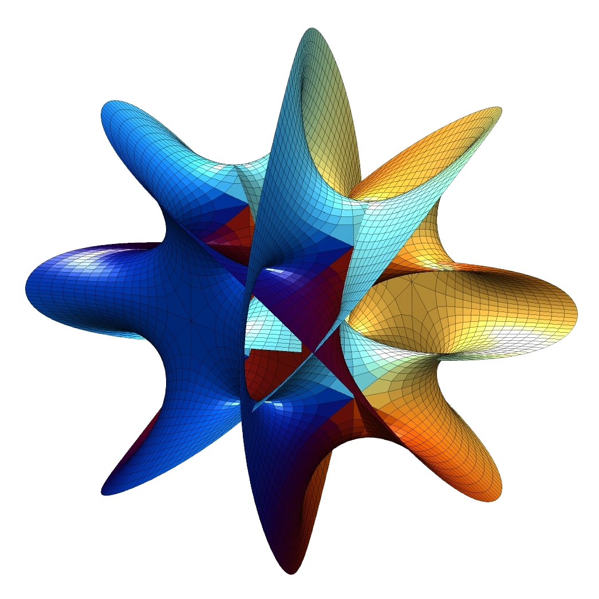

# Manifold

<p align="center">
  
</p>

Native desktop app for **semantic search across your local files** using **Gemini multimodal embeddings** + **Convex vector search**.

## Features

- **Local file access** (Tauri) with configurable **include/exclude** paths
- **Supported types**: `png`, `jpg/jpeg`, `pdf`, `mp3`, `wav`, `mp4`, `mov`
- **Embeddings**: Gemini `gemini-embedding-2-preview` (client-side API calls; cached locally)
- **Index + search**: vectors + metadata stored in your **own Convex deployment**, searched via **Convex vector indexes**
- **Results**: relevance score + local path + best-effort thumbnail for images

## Setup (developer)

### Prereqs

- Node + pnpm
- Rust toolchain
- Tauri prerequisites for your OS: see Tauri docs

### Install deps

```bash
pnpm install
```

### Configure env

Create `.env.local` from `.env.example` and fill:

- `VITE_CONVEX_URL`
- `CONVEX_DEPLOYMENT` (used by Convex CLI)
- `VITE_GOOGLE_GENERATIVE_AI_API_KEY`

### Start Convex (dev)

```bash
npx convex dev
```

### Run the desktop app

```bash
pnpm tauri dev
```

## Notes

- **Your Gemini API key stays on-device** (the desktop app calls Gemini directly). Convex stores embeddings + metadata only.
- Don’t commit `.env.local`.

## Contributing

- Issues and PRs are welcome.
- Keep changes small and focused.
- Please avoid introducing new file types without adding both: (1) a MIME mapping, and (2) an embedding + size limit path.
